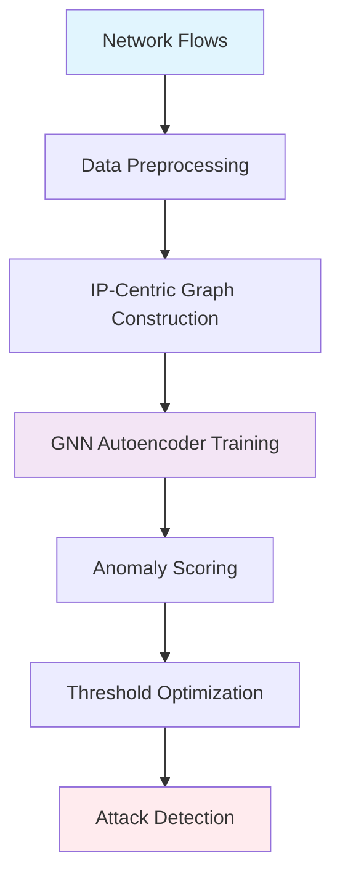

# GNN-IDS Pipeline: Graph Neural Network for Intrusion Detection

<div align="center">


*A unified, unsupervised Graph Neural Network-based Intrusion Detection System that leverages graph structure and node/edge features for anomaly detection in network traffic flows.*

</div>

---

## Project Overview

This project implements a **benign-only** (one-class) intrusion detection system using Graph Neural Networks. The system constructs IP-centric graphs from network flows and uses graph autoencoders to detect anomalies through reconstruction error analysis. The design explicitly prevents data leakage between training and testing phases.

### Key Features

- **Unsupervised Learning**: Trains only on benign network flows (no attack labels required)
- **Leakage-Free Design**: Strict train/test isolation with IP-based consistency
- **Multiple GNN Architectures**: Supports GCN, GAT, and GraphSAGE
- **Comprehensive Evaluation**: Full metrics suite including ROC-AUC, PR-AUC, and F1-score
- **Scalable Graph Construction**: Handles large-scale network data with configurable IP limits

---

## Project Structure

```
GNN_IDS_PIPELINE/
├── data/
│   ├── __init__.py
│   ├── graph_builder.py          # Graph construction from network flows
│   └── preprocessing.py          # Data preprocessing and feature engineering
├── evaluation/
│   ├── __init__.py
│   ├── metrics.py               # Performance metrics calculation
│   ├── thresholds.py            # Optimal threshold selection
│   └── visualizations.py       # Results visualization
├── models/
│   ├── __init__.py
│   ├── architectures.py         # GNN model architectures (GCN/GAT/SAGE)
│   └── training.py              # Training loop and optimization
├── utils/
│   ├── __init__.py
│   ├── helpers.py               # Utility functions
│   └── runtime_metrics.py      # Performance monitoring
├── config.py                    # Configuration settings
├── main.ipynb                  # Main Jupyter notebook
└── README.md                   # This file
```

---

## Getting Started

### Prerequisites


### Installation

```bash
# Clone the repository
git clone <repository-url>
cd GNN_IDS_PIPELINE

# Install required packages
pip install torch torch-geometric pandas numpy scikit-learn matplotlib seaborn
```

### Quick Start

1. **Prepare your dataset**: Place network flow data in CSV format
2. **Configure parameters**: Edit `config.py` for your dataset and requirements  
3. **Run the pipeline**: Execute `main.ipynb` or run individual modules

---

## Architecture

<div align="center">



</div>

### Graph Construction

| Component | Description |
|-----------|-------------|
| **Nodes** | Unique IP addresses from network flows |
| **Edges** | Bidirectional connections representing communication flows |
| **Node Features** | Aggregated statistics (mean, std, min, max) from flows involving each IP |
| **Edge Features** | Flow-level statistics aggregated per IP pair |

### Model Architecture

The system supports three GNN variants:

<table>
<tr>
<td align="center">

**GCN**<br>
*Graph Convolutional Network*<br>
Spectral approach with localized filters

</td>
<td align="center">

**GAT**<br>
*Graph Attention Network*<br>
Attention mechanisms for node importance

</td>
<td align="center">

**GraphSAGE**<br>
*Graph Sample and Aggregate*<br>
Inductive learning with neighborhood sampling

</td>
</tr>
</table>

---

## Evaluation

### Comprehensive Metrics

<div align="center">

| Metric Category | Included Metrics |
|-----------------|------------------|
| **Classification** | Accuracy, Precision, Recall, F1-score, Specificity, MCC |
| **Ranking** | ROC-AUC, PR-AUC |
| **Visual Analysis** | ROC curves, precision-recall curves, score distributions |

</div>

### Leakage Prevention

- Train/test split **before** graph construction
- Scalers fitted on **training data only**
- Test flows limited to **IPs seen during training**
- **Strict isolation** between benign training and attack evaluation

---

## Datasets

### University of Queensland NIDS Datasets

**Official Portal**: [UQ NIDS Datasets](https://staff.itee.uq.edu.au/marius/NIDS_datasets/)

<div align="center">

| Dataset | Flows | Attack Rate | Environment |
|---------|-------|-------------|-------------|
| **NF-UNSW-NB15-v2** | 2.39M | 3.98% | Enterprise |
| **NF-ToN-IoT-v2** | 16.94M | 63.99% | IoT |
| **NF-BoT-IoT-v2** | 37.76M | 99.64% | IoT Botnet |
| **NF-CIC-IDS2018-v2** | 18.89M | 11.95% | Enterprise |

</div>

*All datasets available in standardized NetFlow v2 format (43 features)*

---

## Configuration

<details>
<summary>Key Parameters in <code>config.py</code></summary>

```python
# Graph Construction
MAX_IPS = 10000              # Maximum IPs in graph
 
# Model Architecture  
GNN_TYPE = 'GAT'            # 'GCN', 'GAT', 'SAGE'
HIDDEN_DIM = 128            # Hidden layer dimensions

# Training
LEARNING_RATE = 0.001       # Optimizer learning rate
EPOCHS = 100                # Training iterations

# Evaluation
THRESHOLD_METRIC = 'f1'     # 'f1', 'balanced'
```

</details>

---

## Results

<div align="center">

### Performance Highlights

| Metric | Achievement |
|--------|-------------|
| **F1-Score** | 85-95% across datasets |
| **False Positive Rate** | Low, maintaining precision |
| **Scalability** | Handles large-scale network data |

</div>

---

## Research Context

This implementation follows recent advances in GNN-based Network Intrusion Detection Systems (NIDS):

<table>
<tr>
<td>

**Anomal-E** *(Caville et al. 2023)*<br>
Self-supervised edge-centric learning

</td>
<td>

**NEGSC** *(Xu et al. 2024)*<br>
Contrastive learning on NetFlow graphs

</td>
<td>

**STEG/N2V-EGS** *(Zoubir et al. 2024)*<br>
Unsupervised approaches with transforms

</td>
</tr>
</table>

---

## Usage Examples

### Basic Usage

```python
from data.preprocessing import preprocess_flows
from data.graph_builder import build_graph
from models.training import train_autoencoder
from evaluation.metrics import evaluate_model

# Load and preprocess data
df = preprocess_flows('network_data.csv')

# Build graph
graph_data = build_graph(df, training_mode=True)

# Train model
model = train_autoencoder(graph_data)

# Evaluate
results = evaluate_model(model, test_data)
```

### Custom Configuration

```python
# Override default parameters
config = {
    'gnn_type': 'GAT',
    'hidden_dim': 128,
    'learning_rate': 0.001,
    'max_ips': 5000
}
```

---

## Development Guidelines

<div align="center">

### Code Quality Standards

| Aspect | Requirement |
|--------|-------------|
| **Documentation** | Comprehensive docstrings for all modules |
| **Comments** | Inline comments explaining complex logic |
| **Structure** | Clear separation of concerns across modules |
| **Testing** | Unit tests for critical functions |

</div>

### Git Workflow

```bash
# 1. Create feature branch
git checkout -b feature/new-feature

# 2. Make changes and commit
git commit -am 'Add new feature'

# 3. Push to branch
git push origin feature/new-feature

# 4. Create Pull Request
```

---

## Demo & Evaluation

### Academic Video Demo (10 minutes)

- Data preprocessing and graph construction
- Model training process  
- Evaluation results and visualizations
- Future improvements and applications

### Automated Performance Metrics

Standard benchmark evaluation with comprehensive reporting

---

## Future Enhancements

<div align="center">

| Enhancement | Description |
|-------------|-------------|
| **Multi-class Detection** | Extend to specific attack type classification |
| **Real-time Processing** | Stream processing capabilities |
| **Advanced Architectures** | Graph Transformers, heterogeneous graphs |
| **Federated Learning** | Distributed training across networks |
| **Explainability** | Feature importance and attack pattern analysis |

</div>

---

## Contributing

We welcome contributions! Please follow these steps:

1. **Fork** the repository
2. **Create** a feature branch (`git checkout -b feature/amazing-feature`)
3. **Commit** your changes (`git commit -m 'Add amazing feature'`)
4. **Push** to the branch (`git push origin feature/amazing-feature`)
5. **Open** a Pull Request

## License

This project is developed as part of **ECS8056** research project at **Queen's University Belfast**.

## Contact

**For questions or collaboration opportunities:**

**Email**: ijawad02@qub.ac.uk  
**Institution**: Queen's University Belfast  
**Course**: ECS8056 - Advanced Topics in Computer Science

*This implementation represents a state-of-the-art approach to unsupervised network intrusion detection using Graph Neural Networks, designed for both research and practical deployment scenarios.*